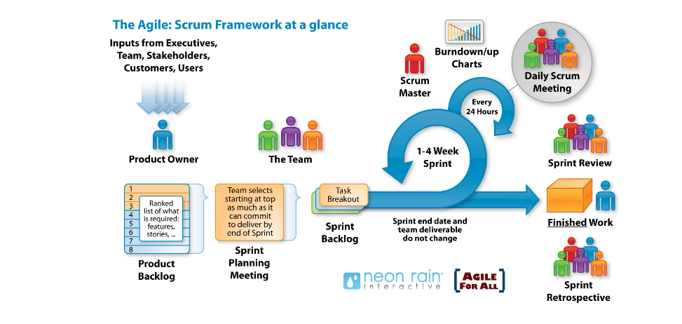

# Project Management Guidelines

## Why Formal Project Management

Formal project management is important for many reasons, here are a couple. First, standards help collaboration: if a member of staff goes temporarily from Team A to Team B, they should not feel lost in a different way to work, they should recognise the words, meetings, tools and concepts your team are using to keep the project organised/moving. Second, a well organised team is a healthy team: everyone likes to feel that their project is being managed with some sort of method.

We strongly recommend using Scrum and Kanban project management methods as a reference for your own project management method. Depending on the size and characteristic of your team and project, you might adapt them, but the main ideas should remain part of the workflow.

## Definitions

Definition of Agile is to move easily and quickly. Agile project management is an iterative approach to managing projects that focus on continuous releases and incorporating customer feedback with every iteration.

## Tools

**Scrum**  is the most popular approach to agile. Scrum provides a simple framework for teams to work together collaboratively in short sprints. The approach encourages a focus on only what is needed and enables teams to demonstrate success continuously and obtain feedback early.

**Kanban board ** is a brilliant visual tool that gives an overview of current work status and simplifies team communication. Kanban boards in Jira helps teams visualise their workflow so the team know where work stands at a glance by displaying the most relevant information for each story and task.

## People (roles)

**Product owner** - is someone who identifies what needs to be built/developed for each sprint. The product owner is the team member who speaks as the one voice of the customer. This person represents the needs and desires of the stakeholder community to the agile delivery team. They clarify any details regarding the solution and is also responsible for maintaining a prioritized list of work items that the team will implement to deliver the solution. While the product owner may not be able to answer all questions, it's their responsibility to track down the answer in a timely manner so the team can stay focused on its tasks. Each agile team has a single product owner.

**Scrum master - ** a person helps the team to focus on tasks and encourages collaboration between team and product owner

1. Stand ups – Facilitate daily stand ups (scrum) as needed

1. Sprint planning meetings- protect the team from over-committing and scope creep.

1. Sprint reviews- Participate in the meeting and capture feedback.

1. Retrospectives- Notes areas for improvement and action items for future sprints

1. Board administration- work as the administrator of the scrum board. Ensure cards are up to date and Kanban board is working well

**Being a team member - ** The role of team members focuses on producing the actual solutions for stakeholders. Team members perform testing, analysis, architecture, design, programming, planning, estimation, and many more activities as appropriate throughout the project. Not every team member has every single skill (at least not yet), but they have a subset of them and strive to gain more skills over time. Team members identify, estimate, sign-up for, and perform tasks and track their completion status.

### Requirements management

**Backlog- ** this is a prioritised list of work for the team, so they know what to deliver first.

**Epics – ** these are large bodies of work that can be broken down into several smaller tasks (called stories) Epics are the drivers that drive towards the bigger goals.

**User stories ** – User story is the smallest unit of work in an agile framework. Its an end goal.

**Tasks ** – these are used to break down user stories even further, tasks are the smallest unit used in scrum to track work. A task should be completed by one person on the team, though the team may choose to pair up when doing work.

**Example of EPIC user stories and Tasks. **

The Epic is to build a complete longitudinal WERL dataset one of the stories to achieve this epic is to require data into DAP. To achieve this story, it was broken down into 6 tasks

1. Raise a service desk call to obtain data

1. Team to check missing files match files outside of DAP

1. Create a list of missing files

1. Ingest missing files to existing quarters

1. Ingest all files for missing quarters

1. Solve duplication issues ** **

**Creating epics and user stories **

**A user story -**  is a simple description of a requirement in terms of what that requirement must accomplish for whom. User stories are intended as a lightweight technique that allows the team to work fast, stories should be embedded in conversation. The product owner and team should discuss the stories together. This allows teams to capture the minimum amount of information, reduce overhead and accelerate delivery.  Write your stories so that they are easy to understand. Keep them simple and concise. Avoid confusing and ambiguous terms and use active voice. Focus on what's important and leave out the rest.

### Ceremonies

**Sprint - ** A sprint is a short fix time period, when a team works to complete a set amount of work from their backlog. Sprints are at the very heart of scrum and agile methodologies and getting sprints right will help the team ship better outputs with fewer headaches.

**Sprint planning - ** a meeting to define what can be delivered in the sprint and how the work will be achieved.

**Sprint backlog-**  this is a list of tasks identified by the team to complete during the sprint

**Daily scrum meetings**  - to inspect progress, resulting the team to decided days' work. A daily scrum is like a sports team huddle gives the team opportunity to talk through three simple questions

1. What did I work on yesterday?

1. What am I working on today?

1. What issues are blocking me?

Theses questions highlight progress and help flag team blockers. Also, it strengthens the team when everyone shares progress they're contributing to the team.

**A sprint review**  is about demonstrating the hard work of the entire team: analysts, data science, and the product owner.  Team members gather around a desk for informal demos and describe the work they've done for that iteration. It's a time to ask questions, try new features, and give feedback. Sharing in success is an important part of building an agile team. Sprint reviews are not retrospectives, at the end of each sprint a discussion about what the team is building

**Retrospective meeting **  is an excellent opportunity for the team to discuss what went well and not so well during the sprint and create a plan to address improvements for future sprints. The retrospective provides a safe place to focus on introspection and adaptation. In order for retrospectives to be successful, there needs to be a supportive atmosphere that encourages (but doesn't force) all team members to contribute.
